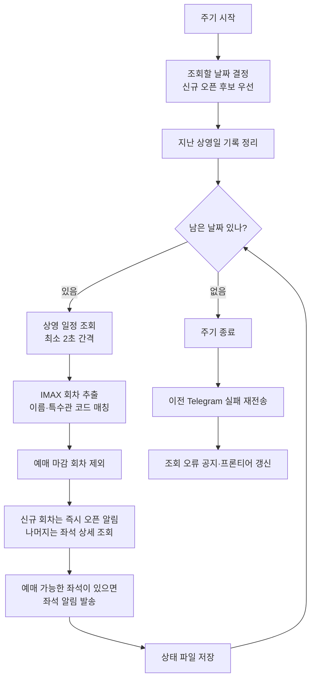
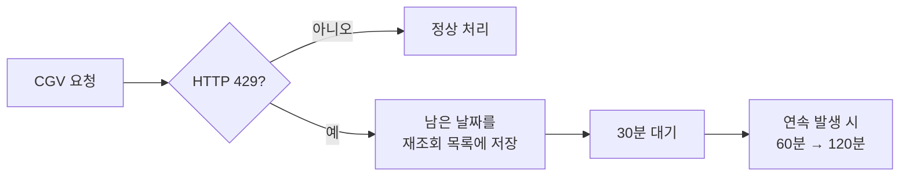
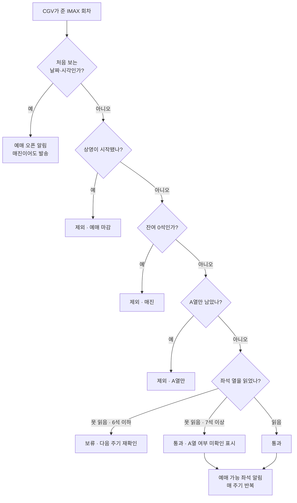
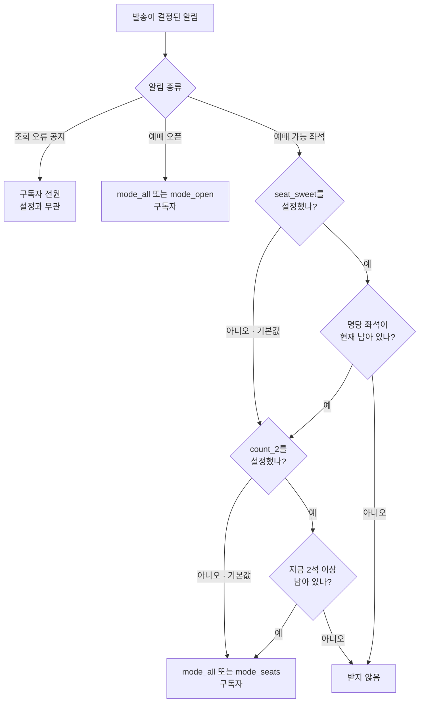
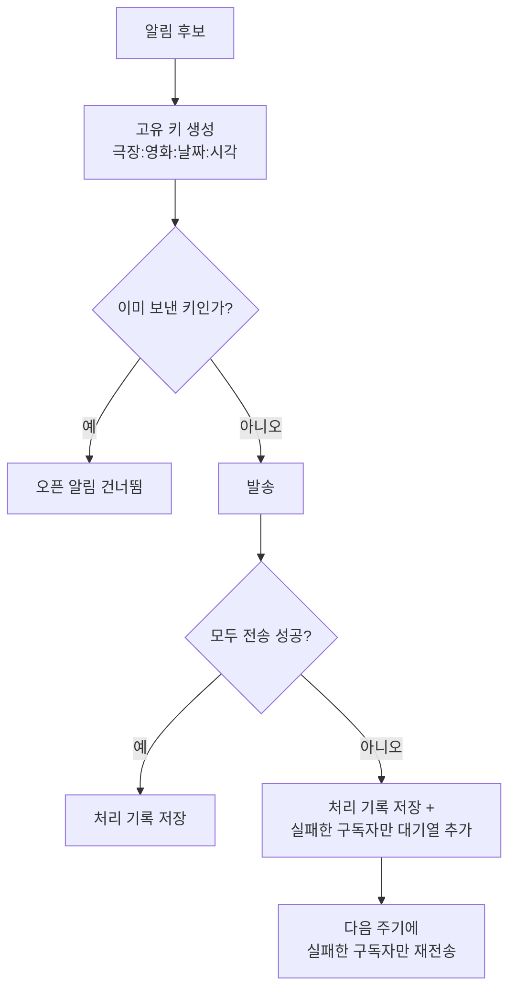

# 알림 판정 흐름

봇이 CGV 응답에서 회차 하나를 뽑아 알림으로 만들거나 버리기까지의 순서, 그리고 그 알림이 구독자별로 어떻게 갈라지는지를 정리한 문서입니다. `watcher.py`의 `run_cycle()` 기준입니다.

---

## 1. 한 주기의 흐름

봇은 조회 → 판정 → 발송을 약 1분 주기로 반복합니다. **신규 오픈 후보를 맨 먼저 확인한 뒤, 날짜 하나를 읽으면 그 자리에서 좌석 상세까지 처리하고 알림을 보냅니다.** 취소표는 시간이 지나면 값이 사라지므로 다음 날짜로 넘어가기 전에 발송합니다.

프론티어 바로 다음의 신규 오픈 후보 `+1일 → +2일 → +3일`을 먼저 조회합니다. 여기서 회차가 잡히면 **회차가 없는 날짜가 나올 때까지** 하루씩 이어서 조회해 새로 열린 구간의 끝을 찾고, 거기서 멈춥니다. 그다음 `오늘 → 내일 → … → 프론티어` 순서로 이미 열린 날짜를 조회합니다. 신규 오픈 탐색이 항상 주기의 맨 앞에서 끝나므로, 그 뒤로는 날짜마다 좌석 상세까지 끝내고 다음 날짜로 넘어가도 오픈 감지가 늦어지지 않습니다.

> **왜 이렇게 바꿨나**
> 좌석 상세를 주기 끝으로 몰면 오늘 상영분의 취소표를 6초에 인식하고도 34초에야 보내게 됩니다. 날짜별로 끝내도록 되돌려 인식과 발송 사이가 **2초**로 줄었습니다. 신규 오픈 탐색은 커서가 주기 맨 앞(0~4초)에서 끝내므로 영향을 받지 않습니다.

### 요청이 막히면

이미 발송한 날짜의 알림은 그대로 남습니다. 실패했거나 429 뒤에 생략된 날짜는 상태 파일에 저장해 다음 정상 주기에 신규 오픈 후보 다음 순서로 우선 재조회합니다.

---

## 2. 회차 하나가 통과해야 하는 관문

IMAX 회차로 걸러진 뒤에도 다섯 개의 관문이 남아 있고, 대부분은 여기서 조용히 탈락합니다.

**제외**는 현재 좌석 상태로는 알림 조건에 맞지 않는다는 뜻이고, **보류**는 좌석표에서 A열 여부를 확신할 수 없어 알림을 버리지 않고 재확인까지 잠시 미룬다는 뜻입니다. 신규 회차는 이 관문을 거치지 않고 상영 시작시간과 좌석 수만으로 즉시 오픈 알림이 나갑니다. 좌석표는 그다음 주기에 읽습니다.

### 잔여 수가 그대로여도 다시 읽는 날짜

상영 일정 응답에는 전체 잔여 수만 있습니다. A열 1석이 팔리는 동시에 A열이 아닌 1석이 취소되면 전체 수가 그대로라, 잔여 수만 비교해서는 좌석 구성 변화를 볼 수 없습니다. 그래서 임박한 날짜는 잔여 수와 무관하게 좌석표를 다시 읽습니다.

| 상영일 | 좌석표를 다시 읽는 시점 |
|---|---|
| 오늘·내일 | 매 주기 |
| +2일 ~ +6일 | 하루씩 돌아가며, 5주기에 한 번 |
| +7일 이후 | 잔여 수가 바뀔 때만 |

전체 범위를 매 주기 다시 읽으면 주기가 세 배 가까이 길어져, 이 장치가 잡으려던 취소표 알림이 오히려 늦어집니다. 그래서 취소표가 가장 자주 나오는 임박한 날짜에 집중합니다. `SEAT_RECHECK_ALWAYS_DAYS`, `SEAT_RECHECK_ROTATE_DAYS`, `SEAT_RECHECK_ROTATE_CYCLES`로 조절합니다.

| 결과 | 의미 |
|---|---|
| 제외 | 현재 좌석 상태에서는 알리지 않습니다. 매 주기 다시 판단합니다. |
| 보류 | 판단을 미룹니다. 좌석 상세 조회가 성공하면 그때 제외 또는 발송으로 갈립니다. |
| 통과 | 발송 후보가 됩니다. 실제 수신자는 구독자 설정이 다시 한 번 거릅니다. |

좌석 열을 못 읽었을 때 6석 이하를 보류하는 이유는 남은 자리가 전부 A열일 가능성을 배제할 수 없기 때문입니다. 7석 이상이면 A열 밖 좌석이 섞여 있을 가능성이 충분하다고 보고 `A열 여부 미확인` 표시와 함께 내보냅니다.

같은 회차가 처음 감지된 주기에는 **예매 오픈 알림만** 가고 좌석 알림은 보내지 않습니다. 한 번의 관측으로 두 통이 가는 것을 막기 위해서입니다.

신규 회차는 위 관문을 아예 거치지 않습니다. **등록된 적 없는 상영일·시작시간 조합이면 매진이어도 오픈 알림을 보냅니다.** 회차가 생겼다는 사실이 그 자체로 정보이고, 취소표 알림은 오픈 알림을 보낸 회차에서만 나가므로 여기서 빼면 그 회차는 영영 조용해집니다.

### 변화가 아니라 재고를 알립니다

좌석 알림은 잔여 수가 **바뀌었을 때**가 아니라 예매 가능한 자리가 **있을 때** 나갑니다. 3석이 며칠째 그대로 남아 있어도 주기마다 알립니다. 구독자가 알고 싶은 것은 "숫자가 움직였다"가 아니라 "지금 예매할 자리가 있다"이기 때문입니다. 매진된 회차만 조용합니다.

발송량이 많으면 `SEAT_ALERT_REPEAT_MINUTES`로 반복 간격을 둘 수 있습니다. 좌석 수가 실제로 바뀐 경우에는 이 간격과 관계없이 항상 보내고, 값이 그대로인 회차의 반복만 미룹니다.

---

## 3. 그 알림을 누가 받는가

발송이 결정돼도 구독자 전원에게 가지는 않습니다. 구독자는 `/mode`로 **알림 종류**를, `/seat`으로 **좌석 대상**을, `/count`로 **예매 가능 최소 좌석**을 고릅니다. 세 설정은 서로 독립적으로 작동합니다.

| 알림 | `/mode_all` | `/mode_open` | `/mode_seats` | `/seat_sweet` 적용 시 | `/count_2` 적용 시 |
|---|:---:|:---:|:---:|---|---|
| 🎟️ 예매 오픈 | 받음 | 받음 | — | 영향 없음 | 영향 없음 |
| 💺 예매 가능 좌석 | 받음 | — | 받음 | 명당 좌석이 남았을 때만 | 2석 이상 남았을 때만 |
| ⚠️ 조회 오류 공지 | 받음 | 받음 | 받음 | 영향 없음 | 영향 없음 |

`/seat_sweet`은 좌석 알림에만 적용됩니다. 정확한 행·번호를 확인한 뒤 F16~29, G16~29, H13~32, I13~32, J11~34, K11~34, L11~34 중 예매 가능한 좌석이 남아 있을 때만 전송합니다. 좌석표에서 A열 여부를 읽지 못하면 명당 여부를 판별할 수 없어 `/seat_sweet` 구독자에게는 보내지 않습니다. 예매 오픈 알림은 항상 전송됩니다.

`/count_2`도 좌석 알림에만 적용되며, **지금 남아 있는 A열 제외 좌석 수**를 봅니다. `/seat_sweet`과 함께 쓰면 명당 구역 안에 남은 수로 판단합니다.

전체 잔여 수는 기준으로 쓰지 않습니다. 전체 수에는 A열이 섞여 있어서, 2석이 남아도 그중 하나가 A열이면 `/count_2`가 요구한 2석이 아니기 때문입니다. 그래서 좌석표에서 A열 여부를 읽지 못한 회차(`⚠️ A열 여부 미확인`)는 확인된 A열 제외 좌석 수만으로 판단하며, 그 수조차 읽지 못하면 `/count_2` 구독자에게는 보내지 않습니다. `/seat_sweet`이 같은 상황에서 취하는 정책과 동일합니다.

기본값(`/count_1`)은 문턱이 1이라는 뜻이 아니라 **문턱이 없다**는 뜻입니다. 좌석 수를 읽지 못한 회차의 알림도 그대로 받습니다.

**설정한 적 없는 구독자는 전부 받습니다.** 저장된 값이 없으면 `/mode_all` + `/seat_all` + `/count_1`로 취급합니다.

---

## 4. 같은 알림이 두 번 가지 않는 이유

알림 서비스에서 중복 발송은 구독 해지로 직결됩니다. 회차마다 고유 키를 만들어 오픈 알림을 처리한 기록을 남깁니다. 일부 구독자 전송만 실패하면 실패한 사람과 메시지를 별도 대기열에 저장하고 다음 주기에 그 사람에게만 재전송합니다.

| 장치 | 내용 |
|---|---|
| 고유 키 | `0013:30001323:2026-08-26:14:30` — 극장·영화·날짜·시각. CGV 내부 ID를 쓰지 않아 CGV가 그 값을 바꿔도 중복 판정이 깨지지 않습니다. |
| 좌석 스냅샷 | 전체 잔여 수, A열 제외 유효 좌석 수, 잔여 좌석의 행·번호를 저장합니다. 좌석 알림은 값의 변화가 아니라 현재 재고를 기준으로 만들며, 스냅샷은 이전 값 표시와 재조회 판단에 씁니다. |
| 자동 정리 | 지난 상영일의 기록은 매 주기 삭제합니다. 상태 파일이 무한히 커지지 않습니다. |
| 수신자 0명 | 그 알림을 원하는 구독자가 없으면 발송은 건너뛰되 기록은 남깁니다. 그러지 않으면 매 주기 재평가하게 됩니다. |

---

## 5. 조절할 수 있는 값

| 환경변수 | 기본값 | 바꾸면 생기는 일 |
|---|---:|---|
| `POLL_INTERVAL_SECONDS` | `60` | 조회 주기. 줄이면 감지가 빨라지지만 CGV 차단 위험이 커집니다. |
| `CGV_REQUEST_SPACING_SECONDS` | `2` | 요청 사이 최소 간격. 한 주기에 걸리는 시간을 사실상 이 값이 결정합니다. |
| `BOOKING_CLOSE_MARGIN_MINUTES` | `0` | 상영 시작 몇 분 전부터 예매 마감으로 볼지. CGV가 일찍 닫으면 올리세요. |
| `SCAN_MODE` | `cursor` | 신규 오픈 후보 날짜를 먼저 확인하고 조회 요청도 줄입니다. |
| `SEAT_ALERT_REPEAT_MINUTES` | `0` | 좌석 수가 그대로인 회차의 반복 알림 간격. `0`은 매 주기 발송입니다. |
| `SEAT_RECHECK_ALWAYS_DAYS` | `2` | 잔여 수가 그대로여도 매 주기 좌석표를 다시 읽을 일수. 늘리면 주기가 길어집니다. |
| `SEAT_RECHECK_ROTATE_DAYS` | `7` | 그 뒤로 순환하며 다시 읽을 일수. |
| `RATE_LIMIT_BACKOFF_INITIAL_SECONDS` | `1800` | 429를 만난 뒤 첫 대기 시간. 연속 발생하면 두 배씩 늘어납니다. |

전체 설정 목록은 [DEVELOPMENT.md](../DEVELOPMENT.md)에 있습니다.

---

CGV 로그인 정보와 쿠키는 사용하지 않으며, 자동 예매 기능은 없습니다.
