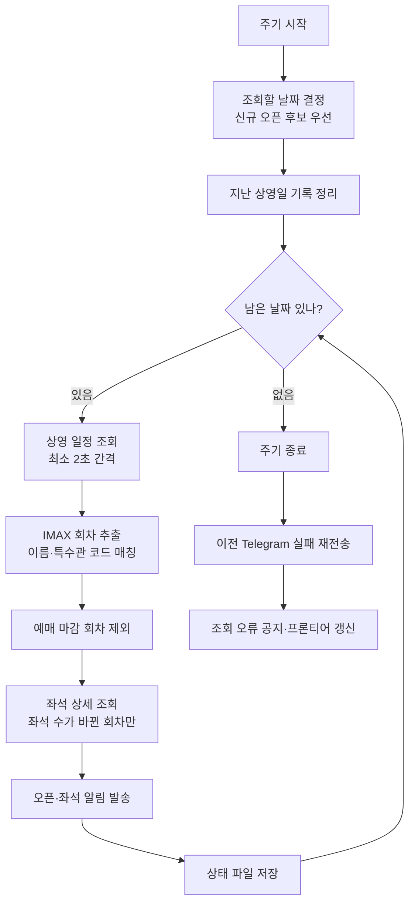
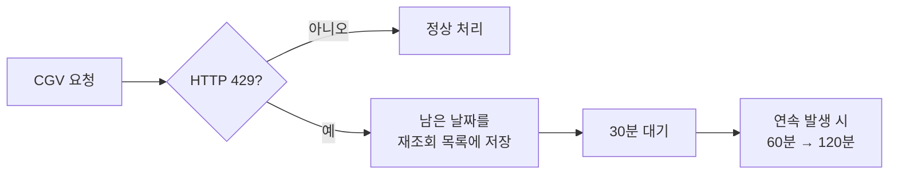
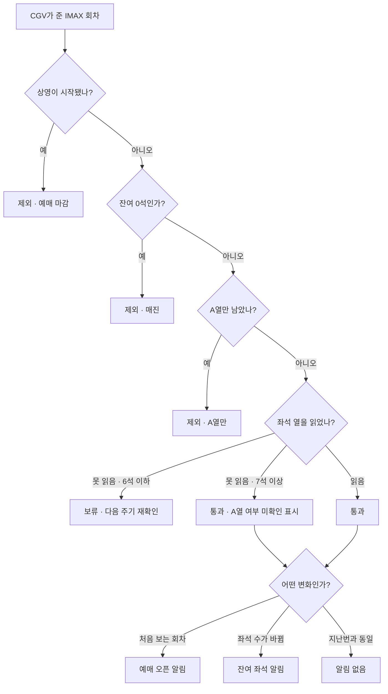
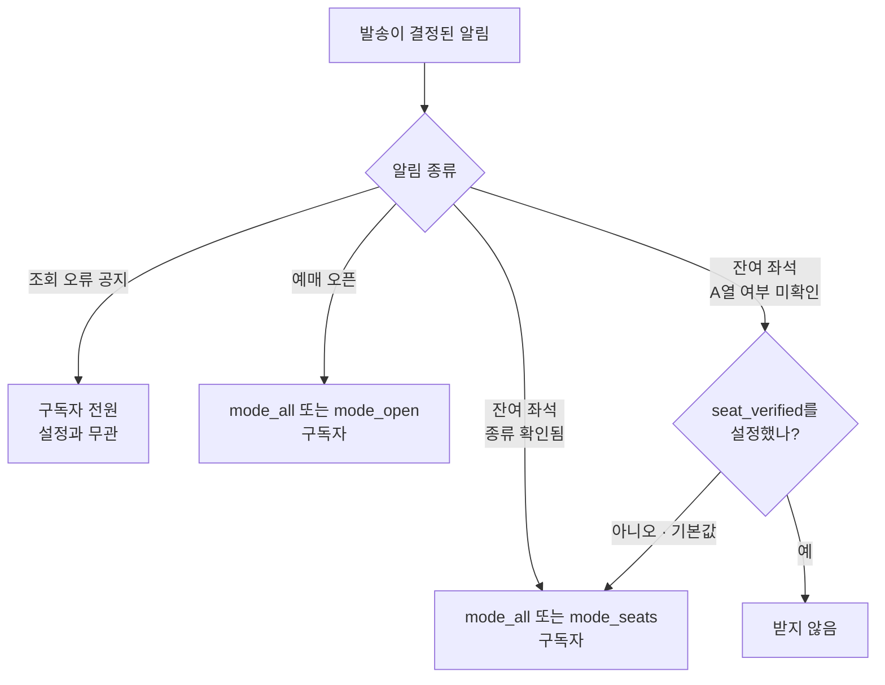
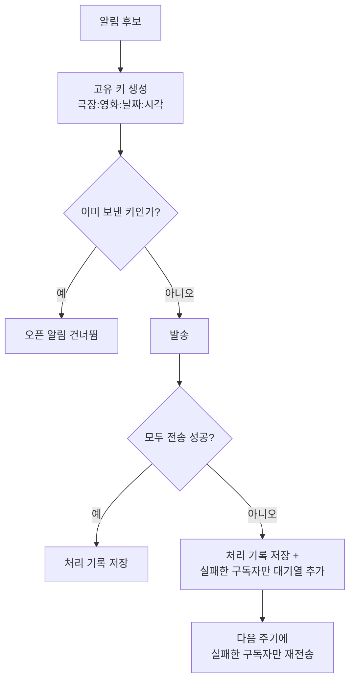

# 알림 판정 흐름

봇이 CGV 응답에서 회차 하나를 뽑아 알림으로 만들거나 버리기까지의 순서, 그리고 그 알림이 구독자별로 어떻게 갈라지는지를 정리한 문서입니다. `watcher.py`의 `run_cycle()` 기준입니다.

---

## 1. 한 주기의 흐름

봇은 조회 → 판정 → 발송을 약 1분 주기로 반복합니다. **신규 오픈 후보를 맨 먼저 확인한 뒤, 날짜 하나를 읽으면 그 자리에서 좌석 상세까지 처리하고 알림을 보냅니다.** 취소표는 시간이 지나면 값이 사라지므로 다음 날짜로 넘어가기 전에 발송합니다.

프론티어 바로 다음의 신규 오픈 후보 `+1일 → +2일 → +3일`을 먼저 조회합니다. 여기서 회차가 잡히면 **회차가 없는 날짜가 나올 때까지** 하루씩 이어서 조회해 새로 열린 구간의 끝을 찾고, 거기서 멈춥니다. 그다음 `오늘 → 내일 → … → 프론티어` 순서로 이미 열린 날짜를 조회합니다. 신규 오픈 탐색이 항상 주기의 맨 앞에서 끝나므로, 그 뒤로는 날짜마다 좌석 상세까지 끝내고 다음 날짜로 넘어가도 오픈 감지가 늦어지지 않습니다.

> **왜 이렇게 바꿨나**
> 좌석 상세를 주기 끝으로 몰면 오늘 상영분의 취소표를 6초에 인식하고도 34초에야 보내게 됩니다. 날짜별로 끝내도록 되돌려 인식과 발송 사이가 **2초**로 줄었습니다. 신규 오픈 탐색은 커서가 주기 맨 앞(0~4초)에서 끝내므로 영향을 받지 않습니다.

### 요청이 막히면

이미 발송한 날짜의 알림은 그대로 남습니다. 실패했거나 429 뒤에 생략된 날짜는 상태 파일에 저장해 다음 정상 주기에 신규 오픈 후보 다음 순서로 우선 재조회합니다.

---

## 2. 회차 하나가 통과해야 하는 관문

IMAX 회차로 걸러진 뒤에도 다섯 개의 관문이 남아 있고, 대부분은 여기서 조용히 탈락합니다.

**제외**는 현재 좌석 상태로는 알림 조건에 맞지 않는다는 뜻이고, **보류**는 좌석표에서 A열 여부를 확신할 수 없어 알림을 버리지 않고 재확인까지 잠시 미룬다는 뜻입니다. 아직 오픈 알림을 보내지 않은 신규 회차는 다음 주기(기본 약 1분)에 다시 확인합니다. 이미 알린 회차의 좌석 변화는 기본 5주기마다 다시 확인하며, 잔여 수가 바뀌면 즉시 다시 확인합니다.

| 결과 | 의미 |
|---|---|
| 제외 | 현재 좌석 상태에서는 알리지 않습니다. 이후 좌석 수가 바뀌면 다시 판단합니다. |
| 보류 | 판단을 미룹니다. 좌석 상세 조회가 성공하면 그때 제외 또는 발송으로 갈립니다. |
| 통과 | 발송 후보가 됩니다. 실제 수신자는 구독자 설정이 다시 한 번 거릅니다. |

좌석 열을 못 읽었을 때 6석 이하를 보류하는 이유는 남은 자리가 전부 A열일 가능성을 배제할 수 없기 때문입니다. 7석 이상이면 A열 밖 좌석이 섞여 있을 가능성이 충분하다고 보고 `A열 여부 미확인` 표시와 함께 내보냅니다.

같은 회차가 처음 감지된 주기에는 **예매 오픈 알림만** 가고 좌석 알림은 보내지 않습니다. 한 번의 관측으로 두 통이 가는 것을 막기 위해서입니다.

---

## 3. 그 알림을 누가 받는가

발송이 결정돼도 구독자 전원에게 가지는 않습니다. 알림은 종류가 나뉘고, 구독자는 `/mode`와 `/seat`으로 받을 종류를 고릅니다. 두 설정은 서로 독립적으로 작동합니다.

| 알림 | `/mode_all` | `/mode_open` | `/mode_seats` | `/seat_verified` 적용 시 |
|---|:---:|:---:|:---:|---|
| 🎟️ 예매 오픈 | 받음 | 받음 | — | 영향 없음 |
| 💺 잔여 좌석 (종류 확인됨) | 받음 | — | 받음 | 영향 없음 |
| 💺 잔여 좌석 (A열 여부 미확인) | 받음 | — | 받음 | **안 받음** |
| ⚠️ 조회 오류 공지 | 받음 | 받음 | 받음 | 영향 없음 |

`/seat_verified`는 잔여 좌석 알림에만 적용됩니다. 좌석표에서 A열 여부를 몰라 예매 오픈 자체를 놓치는 편이 더 손해이기 때문입니다.

**설정한 적 없는 구독자는 전부 받습니다.** 저장된 값이 없으면 `/mode_all` + `/seat_all`로 취급하므로, 기능이 추가되기 전부터 구독하던 사람의 수신 내용은 달라지지 않았습니다.

---

## 4. 같은 알림이 두 번 가지 않는 이유

알림 서비스에서 중복 발송은 구독 해지로 직결됩니다. 회차마다 고유 키를 만들어 오픈 알림을 처리한 기록을 남깁니다. 일부 구독자 전송만 실패하면 실패한 사람과 메시지를 별도 대기열에 저장하고 다음 주기에 그 사람에게만 재전송합니다.

| 장치 | 내용 |
|---|---|
| 고유 키 | `0013:30001323:2026-08-26:14:30` — 극장·영화·날짜·시각. CGV 내부 ID를 쓰지 않아 CGV가 그 값을 바꿔도 중복 판정이 깨지지 않습니다. |
| 좌석 스냅샷 | 전체 잔여 수, A열 제외 유효 좌석 수, 잔여 좌석의 행·번호를 저장해 두고 값이 달라졌을 때 좌석 알림을 만듭니다. |
| 자동 정리 | 지난 상영일의 기록은 매 주기 삭제합니다. 상태 파일이 무한히 커지지 않습니다. |
| 수신자 0명 | 그 알림을 원하는 구독자가 없으면 발송은 건너뛰되 기록은 남깁니다. 그러지 않으면 매 주기 재평가하게 됩니다. |

---

## 5. 조절할 수 있는 값

| 환경변수 | 기본값 | 바꾸면 생기는 일 |
|---|---:|---|
| `POLL_INTERVAL_SECONDS` | `60` | 조회 주기. 줄이면 감지가 빨라지지만 CGV 차단 위험이 커집니다. |
| `CGV_REQUEST_SPACING_SECONDS` | `2` | 요청 사이 최소 간격. 한 주기에 걸리는 시간을 사실상 이 값이 결정합니다. |
| `BOOKING_CLOSE_MARGIN_MINUTES` | `0` | 상영 시작 몇 분 전부터 예매 마감으로 볼지. CGV가 일찍 닫으면 올리세요. |
| `SCAN_MODE` | `cursor` | 신규 오픈 후보 날짜를 먼저 확인하고 조회 요청도 줄입니다. |
| `RATE_LIMIT_BACKOFF_INITIAL_SECONDS` | `1800` | 429를 만난 뒤 첫 대기 시간. 연속 발생하면 두 배씩 늘어납니다. |

전체 설정 목록은 [DEVELOPMENT.md](../DEVELOPMENT.md)에 있습니다.

---

CGV 로그인 정보와 쿠키는 사용하지 않으며, 자동 예매 기능은 없습니다.
